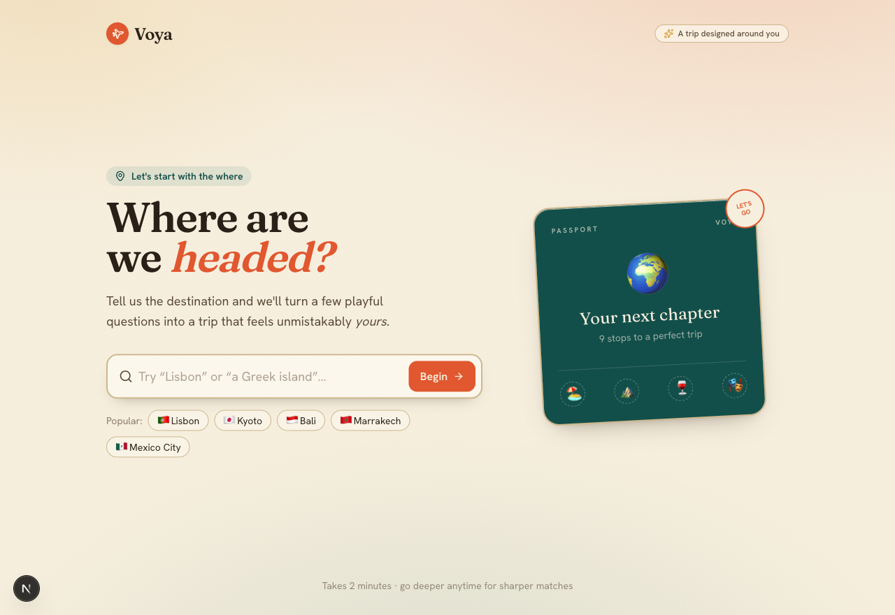
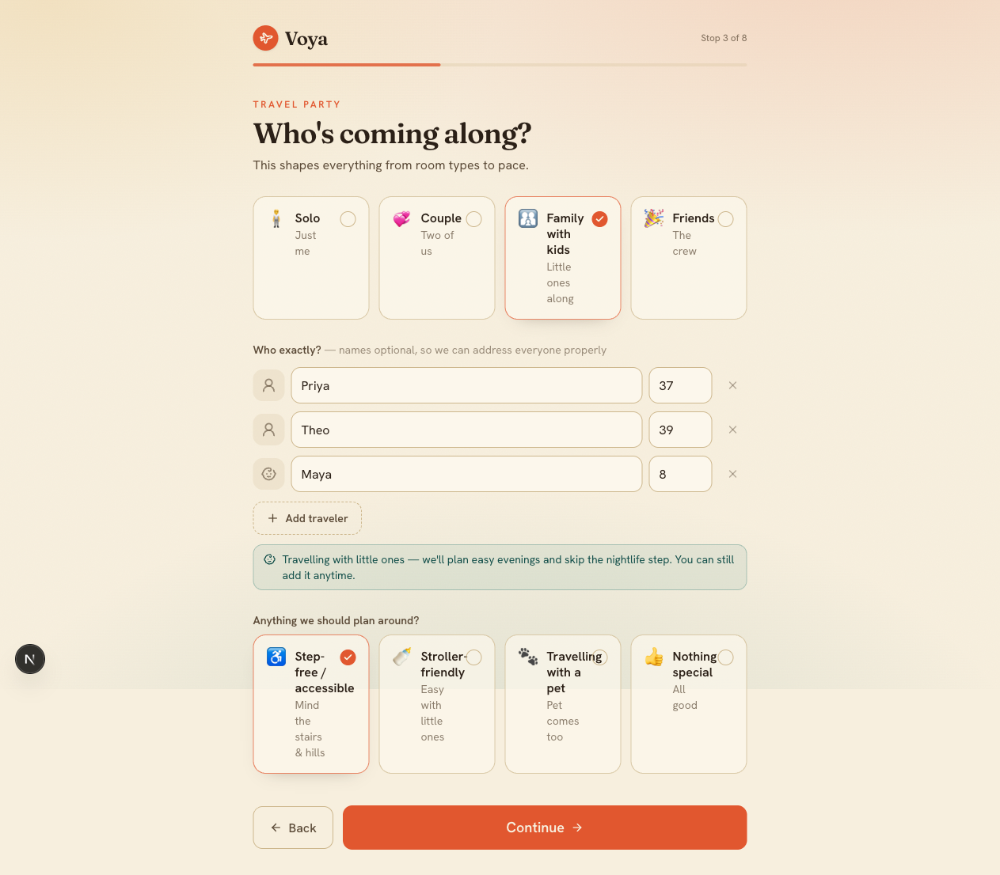
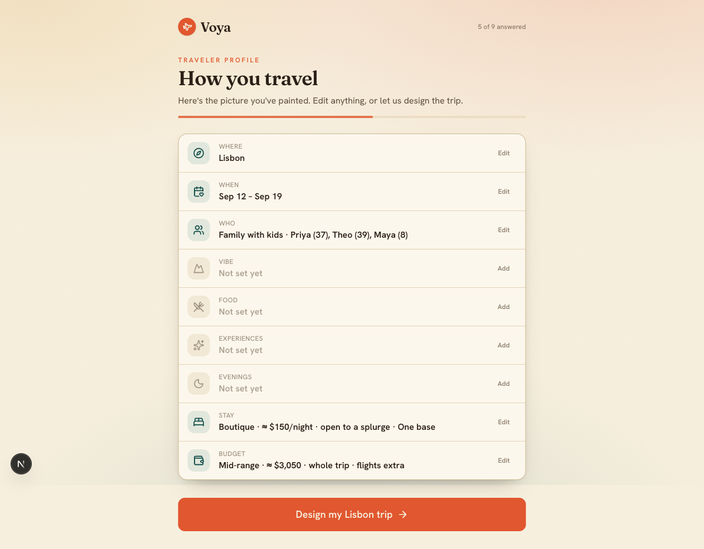
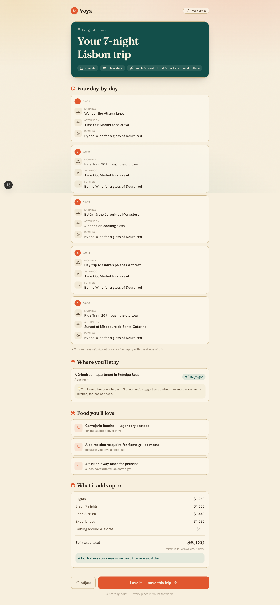

# Voya ✈️

> A gamified AI travel advisor — answer a short, adaptive questionnaire and get a trip designed around *you*.

Voya turns the awkward "so… what kind of trip do you want?" conversation into a calm, playful flow. It learns where you're going, who's coming, how you like to travel, what you eat, where you'll sleep, and what you'll spend — then turns that into a tailored day-by-day itinerary.

This repository is a **working prototype**: the full questionnaire, adaptive branching, and a results page are real and clickable. The recommendation engine behind the itinerary is a deterministic template (not yet a live AI/data service), and "save trip" is a stub.

<p align="center">
  
  
</p>
<p align="center">
  
  
</p>

## Highlights

- **Adaptive questionnaire** — questions, ordering, and progress bend to earlier answers. A family with young kids skips the nightlife step; accessibility needs surface step-free options; minimum-nights gets promoted for groups; meats are skipped for vegetarians.
- **A real traveler profile** — every answer persists (you can reload mid-flow) and assembles into a structured profile.
- **A tailored itinerary** — a day-by-day plan, a matched stay (with rationale when it overrides your pick), food picks that honor your diet, and a budget breakdown that's hidden for luxury travelers.
- **Refined, editorial design** — a warm "Sunlit Passport" aesthetic with gentle motion, not generic SaaS UI.

## Tech stack

- [Next.js 16](https://nextjs.org) (App Router, Turbopack) + TypeScript
- [Tailwind CSS v4](https://tailwindcss.com)
- [Motion](https://motion.dev) for animation
- [lucide-react](https://lucide.dev) icons; [Fraunces](https://fonts.google.com/specimen/Fraunces) + [Hanken Grotesk](https://fonts.google.com/specimen/Hanken+Grotesk) type

## Getting started

```bash
cd web
npm install
npm run dev      # http://localhost:3000
```

Other scripts: `npm run build`, `npm run start`.

## How it works

The questionnaire is **data-driven from a single definition**, with all answers in one store and all conditional behavior in one place:

| File | Responsibility |
| --- | --- |
| `web/lib/trip.ts` | Source of truth: the step `FLOW`, per-step `META`, every answer option, and currency/budget helpers. |
| `web/lib/store.tsx` | `TripProvider` + `useTrip()` — holds the profile, persists it to `localStorage`. |
| `web/lib/branching.ts` | All adaptive logic: predicates, the dynamic `applicableFlow()`, and answer-aware progress/navigation. |
| `web/lib/plan.ts` | `buildPlan(answers)` → the itinerary, stay, food, budget, and adaptive notes. |

Each screen under `web/app/<step>/page.tsx` is a thin view that maps options through `ChoiceTile` inside a shared `QuestionLayout`. Adding or reordering a question is mostly editing `FLOW` + `META`.

See [`CLAUDE.md`](CLAUDE.md) for a deeper architecture guide and [`docs/superpowers/specs/`](docs/superpowers/specs/) for the question-framework spec.

## Status & roadmap

Prototype. Natural next steps:

- Real destination data / AI behind the itinerary
- Destination photography for richer visuals
- Save / share / export a finished trip
- Accounts and a backend

## Routes

`/` → `when` → `who` → `vibe` → `food` → `experiences` → `nights` → `stay` → `budget` → `/summary` → `/celebrate` → `/trip` (itinerary). `/journey` is an overview hub.
